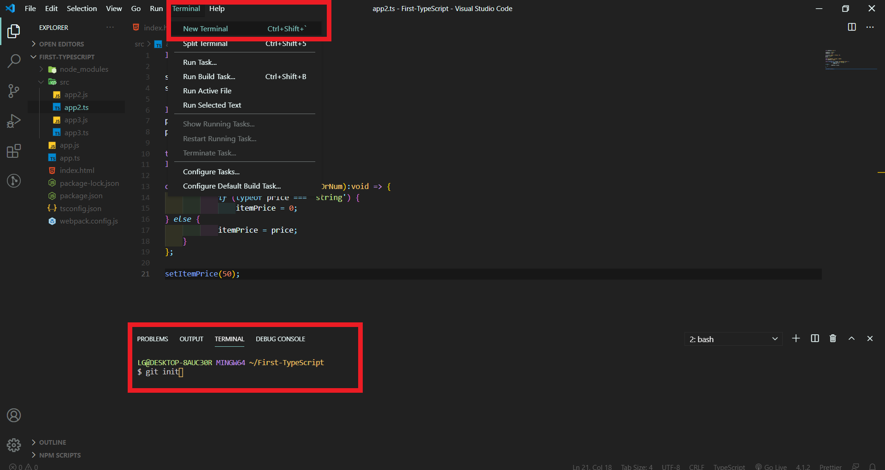
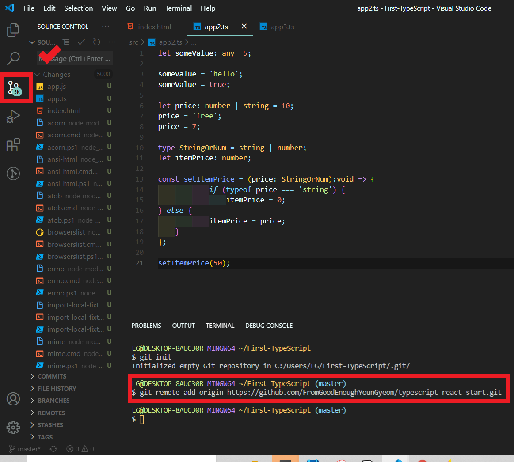
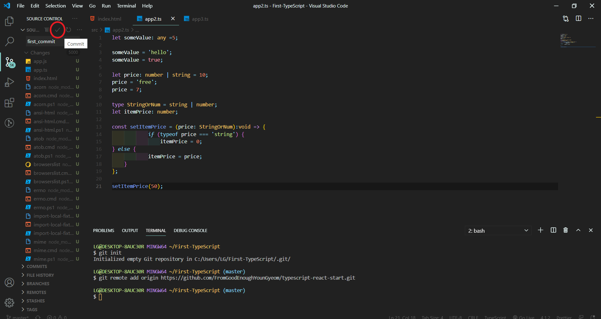
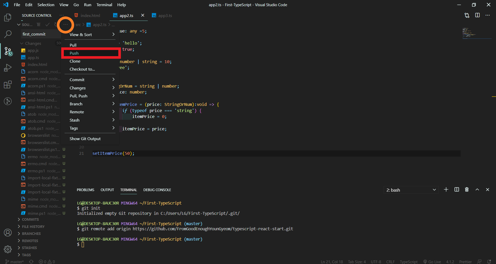
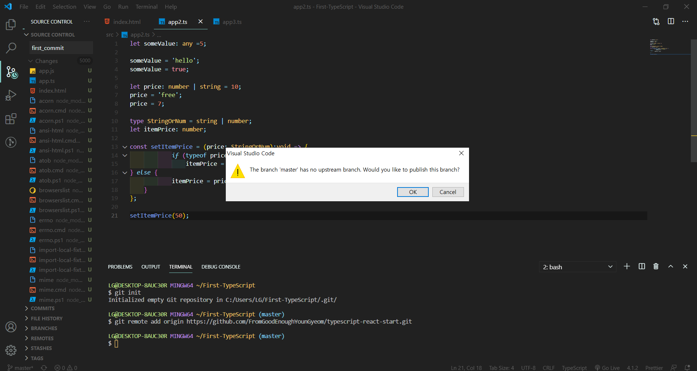
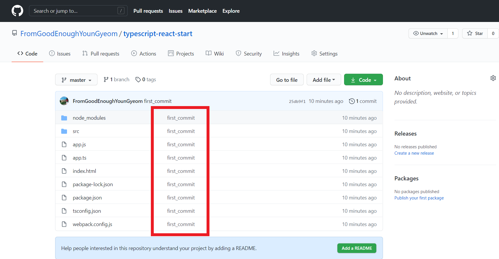

`VsCode`를 사용하여 `Github`에 쉽게 `push`가 가능하도록 로컬저장소와 원격저장소를 연결시켜보자.

## 1. Github에서 원격저장소를 생성한다.

### 1-1. New 버튼을 눌러 원격저장소 생성페이지로 간다.

 
 

### 1-2. 원격저장소의 주소로 쓰일 이름을 지정한 뒤 생성한다.

 
 

### 1-3. 해당부분을 클릭해 원격저장소의 주소를 복사한다.

 
 

## 2. VScode 내에서 원격저장소와 연결하고 싶은 폴더를 열고 터미널에서 Git init을 실행한다.

 
 

## 3. 터미널에서 원격저장소 주소를 연결하고 VsCode내의 왼쪽 세번째에 위치하는 Source Control에서 Commit name을 작성한다.

 
 

## 4. Source Control에서 Commit name을 작성 후 해당버튼을 누르면 commit 상태가 된다.

 
 

## 5. 주황색 표시된 부분을 누르면 Push를 할 수 있다. Push를 하면 원격저장소에 새로운 branch를 만들거냐고 묻는데 ok해주면 된다.

 
 

## 6. 원격저장소에 가서 해당 내용을 확인해볼 수 있다.

 
