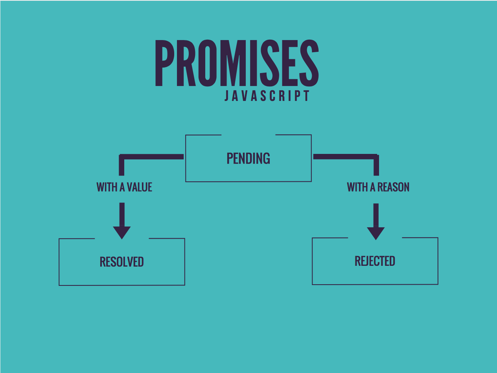

# 프로미스란?

자바스크립트 내에서 [비동기(Asynchronous)](https://goodenoughyoungyeom.netlify.app/Web%20Development/[Web%20Development]%EB%8F%99%EA%B8%B0%EC%99%80%EB%B9%84%EB%8F%99%EA%B8%B0%EC%B2%98%EB%A6%AC/#%EB%B9%84%EB%8F%99%EA%B8%B0asynchronous)처리를 도와주는 object이다. 우리가 처리할 비동기코드(asynchronous code)를 [동기(Synchronous)](https://goodenoughyoungyeom.netlify.app/Web%20Development/[Web%20Development]%EB%8F%99%EA%B8%B0%EC%99%80%EB%B9%84%EB%8F%99%EA%B8%B0%EC%B2%98%EB%A6%AC/#%EB%8F%99%EA%B8%B0synchronous)로 실행되는 것처럼 보이게 한다.
 
 

`Promise`는 어떤 기능을 실행하고 나서 정상적으로 동작하면 성공의 메시지와 함께 처리된 결과값을 전달해준다. 그러나 예상치 못한 문제가 발생하면 error를 전달해 준다.

# 3가지로 나뉘는 Promise의 상태와 흐름

`Promise` 는 생성되고 종료 될 때까지 크게 3가지의 상태로 나뉜다.

1. Pending(보류) : 비동기 처리가 완료되지 않은 상태
2. Fulfilled(이행) : 비동기 처리가 완료되어 결과값을 반환해준 상태
3. Rejected(실패) : 비동기 처리가 실패하거나 오류가 발생한 상태

# 예시

`Promise`는 클래스이기 때문에 `new`라는 키워드를 사용해서 생성해야 한다.
 

`new Promise` 가 생성되는 순간 콜백함수인 `executor` 함수가 자동적으로 실행된다. `executor` 함수는 `resolve`와 `reject` 라는 두 개의 인자를 받게 된다. 이때의 `new Promise()`는 `pending` 상태이다.
 
 

## Producer (생산자, 정보를 제공하는 쪽)

## Consumer (소비자, 정보를 쓰는 쪽)

1. then : producer에서 제공하는 정보를 받아서 비동기적 수행을 담당한다.
2. catch : 에러 핸들링을 담당하는 메소드로 쓰인다. 에러가 발생해도 전체적인 Promise 체인에 문제가 발생하지 않도록 돕는다.
3. finally : 성공이나 실패와 상관없이 마지막으로 실행된다.

