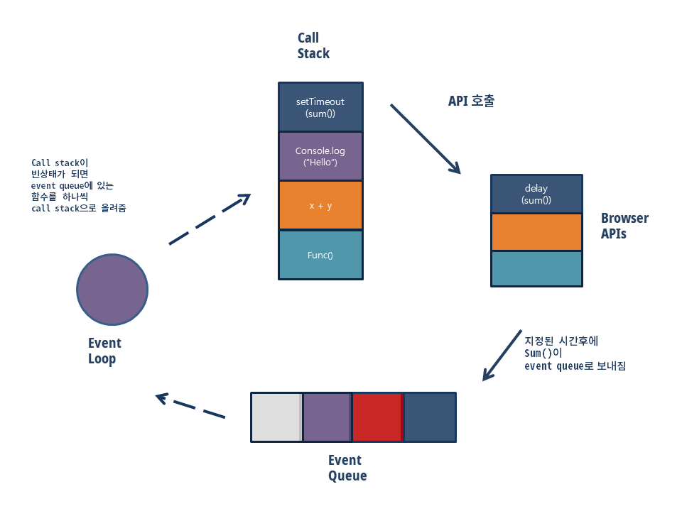
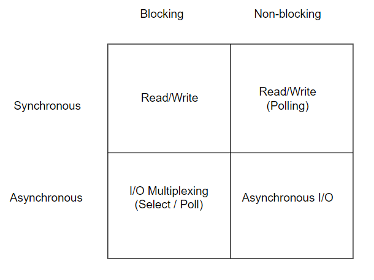

# 미리 보기

> ## `프로세스(process)`
>
> ## `코드(code) 영역`
>
> ## `데이터(data) 영역`
>
> ## `스택(stack) 영역`
>
> ## `힙(heap) 영역`
>
> ## `스레드(thread)`
>
> ## `싱글스레드(Single-threaded)`
>
> ## `콜스택(Call stack)`
>
> ## `Web API(=Brower API)`
>
> ## `테스크 큐(task Queue = event Queue)`
>
> ## `이벤트루프(Event loop)`
>
> ## `동시성(Concurrent)`
>
> ## `비동기(Asynchronous)`
>
> ## `논블로킹(Non Blocking)`

 
 

## 프로세스(process)

운영체제로부터 시스템 자원을 할당받는 작업의 단위이다. 동적인 개념으로는 실행된 프로그램을 의미한다. 기본적으로 프로세스당 최소 1개의 스레드를 가지고 있다. 프로세스는 각각 독립된 메모리 영역(Code, Data, Stack, Heap의 구조)을 할당받는다.
 

## 코드(code) 영역

실행할 프로그램의 코드가 저장되는 영역이다.
 

## 데이터(data) 영역

프로그램의 전역 변수와 정적 변수, 문자열 상수가 저장되는 영역이다.
 

## 스택(stack) 영역

**함수의 호출과 관계되는 지역변수와 매개변수가 저장되는 영역**이다.
한 쪽 끝에서만 자료를 넣고 뺄 수 있는 **LIFO(Last In First Out)**형식의 자료 구조를 가졌다. 즉, 가장 최근에 스택에 추가한 항목이 가장 먼저 제거될 항목이다.
 

## 힙(heap) 영역

**필요에 의해 동적으로 메모리를 할당 할 때 사용**한다. 런타임 시에 크기가 결정된다.
프로그램에 필요한 개체의 개수나 크기를 미리 알 수 없는 경우에 사용한다.
 
 
 
 

## 스레드(thread)

**프로세스의 특정한 수행 경로**이다. 프로세스가 할당받은 자원을 이용하는 실행의 단위이기도 하다.
 
 

## 싱글스레드(Single-threaded)

**한번에 하나의 작업만 수행할 수 있음**을 의미한다. **자바스크립트는 "엔진" (V8 엔진 등)이 싱글스레드로 동작하고, 런타임환경(브라우저/Node)이 멀티스레드를 제공**한다.
 
 
 
 

## 콜스택(Call stack)

Javascript의 런타임에서 **코드가 호출되면서 스택으로 쌓이는 곳, LIFO(Last In First Out)** 방식으로 실행된다.
 
 

## Web API(=Brower API)

Web api는 **웹 브라우저에서 제공하는 api**이다. 여기서 API(Application Programming Interface)란 응용 프로그램에서 사용할 수 있도록, 운영 체제나 프로그래밍 언어가 제공하는 기능을 제어할 수 있게 만든 인터페이스를 뜻한다.
Web api는 DOM 이벤트, Ajax, setTimeout 등의 비동기 작업들을 수행할 수 있도록 API를 지원한다.
 
 

## 테스크 큐(task Queue = event Queue)

web api에서 비동기 작업들이 실행된 후 **호출되는 콜백함수들이 기다리는 공간**이다. 이벤트 루프는 호출 스택이 비워질 때마다 큐에서 콜백 함수를 꺼내온다. **FIFO(First In First Out)** 방식을 따른다.
 
 

## 이벤트루프(Event loop)

항상 루프를 돌면서 call stack과 callback queue를 확인한다. 그러다 **call stack이 빈 상태가 되면, event queue(task Queue 혹은 Callback Queue라고도 지칭함)에 있는 함수를 하나씩 call stack으로 올려주는 역할**을 하는 것이다.
 
 
 
 

## 동시성(Concurrent)

동시성(concurrent)은 실제 물리적으로 동시에 일어나는 것이 아니라, 흐름을 실행시키는 것은 하나(자바스크립트의 경우로 봤을 때, single thread)지만 작은 타임 슬라이스(Time slice, Time quantum) 단위로 다른 흐름을 돌아가면서 실행시켜서 **동시에 일어나는 것처럼 보이게 하는 방식**이다. 논리적인 의미에서 동시 실행으로 볼수 있다.
 
 
 
 

## 비동기(Asynchronous)

Synchronous/Asynchronous는 호출되는 함수의 작업 완료 여부가 관건이다.
호출되는 함수의 작업 완료를 호출한 함수가 신경쓰면 Synchronous, **호출되는 함수의 작업 완료를 호출된 함수가 신경쓰면 Asynchronous** 라고 할 수 있다.
특정 코드의 연산이 끝날 때까지 기다리지 않고 바로 다음 코드를 먼저 실행하는 방식이기도 하다. 다른 주체의 응답 상태와 상관없이 다음 동작을 수행 할 수 있다.
 
 

## 논블로킹(Non Blocking)

Blocking/NonBlocking은 호출되는 함수가 바로 리턴하느냐 마느냐가 관심사이다.
바로 리턴하지 않으면 Blocking이고, **바로 리턴하면 NonBlocking**이다. 이러한 점에서 자바스크립트는 논블로킹 언어이다.
 
 
 
