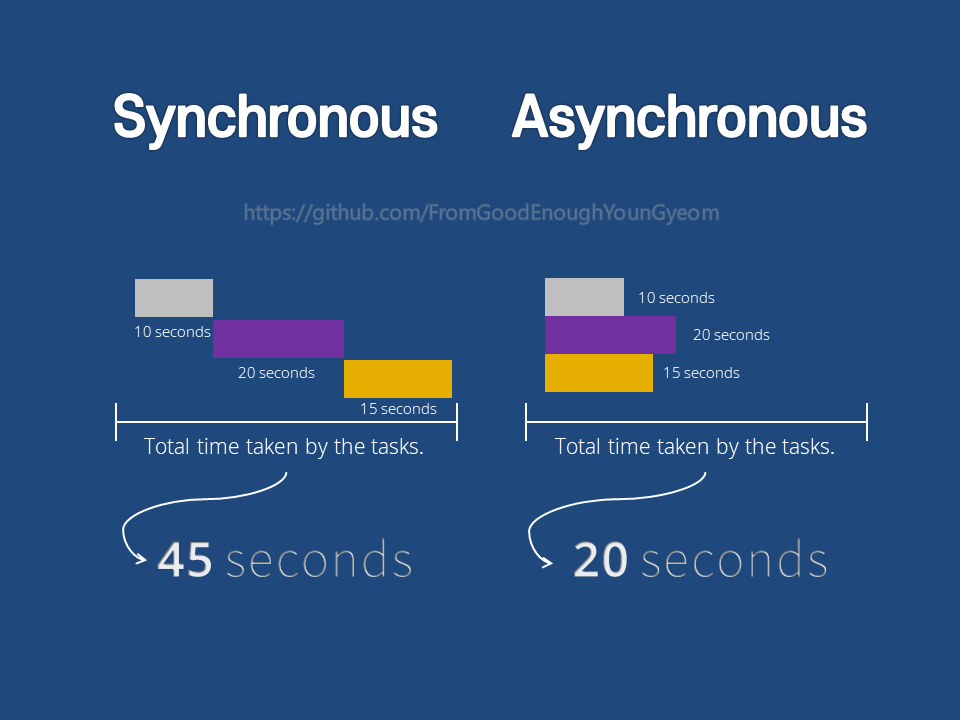

# 동기(Synchronous)

코드가 위에서부터 아래로 내려오면서 **하나의 연산이 끝나야 그다음 코드가 실행**되는 방식이다.
<br/>

```sh
console.log("1st"); // #1

console.log("2nd"); // #2

console.log("3rd"); // #3
```

위와 같은 코드를 작성하고 실행하면
<br/>

```sh
1st // #1

2nd // #2

3rd // #3
```

콘솔에는 이러한 결과가 찍힐 것이다.
<br/>
이처럼 코드가 순차적으로 실행되는 방식을 동기(Synchronous)적 처리 방식이라고 한다.
<br/>

# 비동기(Asynchronous)

특정 코드의 연산이 끝날 때까지 **기다리지 않고 바로 다음 코드를 먼저 실행**하는 방식이다. 응답 상태와 상관없이 다음 동작을 수행 할 수 있다.
<br/>

```sh
console.log("1st"); // #1

setTimeout(()=> { console.log("2nd"); }, 0); // #2

console.log("3rd"); // #3
```

동기적 처리 방식을 설명할때와 다르게 setTimeout() 이라는 메소드를 사용했다. 이것의 첫번째 인자는 콜백함수이고 두번째 인자는 지연시간이다. 위의 경우 지연시간이 0으로 지정되었으므로 지연없이 바로 실행될 것을 예측할 수 있다.
setTimeout() 메소드가 비동기적 API 라는 이해가 없다면 콘솔에 1st, 2nd, 3rd 라고 순차적으로 출력되리라고 예측할 수 있다. 그러나 **setTimeout()은 비동기적 API** 임으로 비동기 방식으로 실행되기 때문에 0초의 지연시간을 입력했다 하더라도

```sh
1st // #1

3rd // #3

2nd // #2
```

콘솔에서는 위의 결과값이 찍히는 것을 볼 수 있다.
<br/>

# 비동기적 처리의 필요성

Ajax Web API 처럼 **원하는 데이터를 서버로 부터 받아와야하는 코드**를 만들고 있다고 가정해 보자.
이러한 코드를 비동기적 처리를 하지 않고 **동기적 처리를 해야한다면** 서버로부터 데이터를 받아오는 코드의 실행이 완전히 끝날때까지 모든것을 기다려야 하므로 **전체페이지의 로딩시간이 굉장히 지연**되는 것으로 보여질 수 있다.
이러한 것들을 해결하기 위해 데이터의 수신과 같이 기다려야하는 코드들을 비동기적으로 처리하는 것이다.
